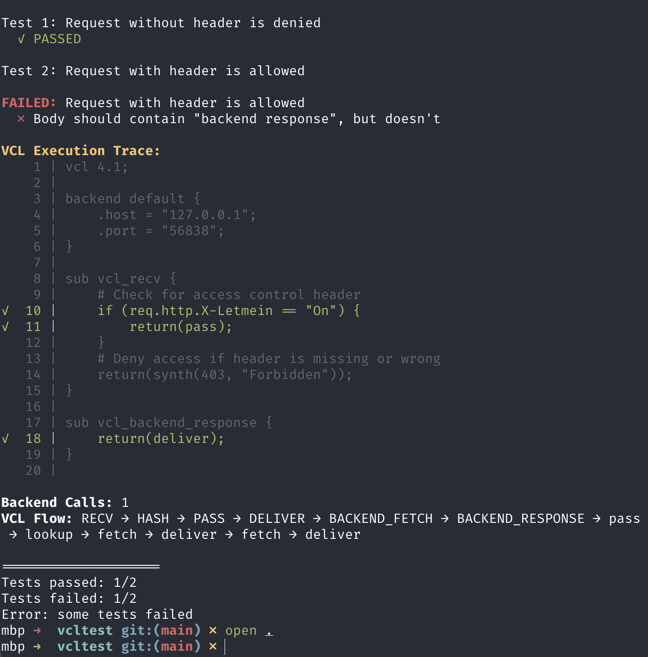

# VCLTest

Unlike VTest2, which is made to test varnishd, this tool is made explicitly to test your VCL.

Development goals:
 * Performance, only compile the VCL one for each VCL to be tested
 * Time travel, you should be able to advance time
 * Reasonable, not perfect, isolation. Ban the cache between test.
 * Familiar or intuitive test syntax

Write tests in YAML, see exactly which VCL lines are executed when tests fail.



## Installation

```bash
git clone https://github.com/perbu/vcltest.git
cd vcltest
go build -o vcltest ./cmd/vcltest
```

### Requirements

- Go 1.21+
- Varnish 6.x+ (`varnishd` and `varnishlog` in PATH)
- libfaketime (optional, for cache TTL tests): `brew install libfaketime` or `apt install faketime`

## Usage

```bash
vcltest [options] <test-file.yaml>

Options:
  -v, -verbose       Enable verbose debug logging
  -vcl <path>        VCL file to use (overrides auto-detection)
  -debug-dump        Preserve all artifacts in /tmp for debugging (no cleanup)
  -generate-schema   Generate JSON Schema for test specification format
  -version           Show version information
```

## Quick Start

**basic.vcl:**

```vcl
vcl 4.1;

backend default {
    .host = "backend.example.com";
    .port = "80";
}

sub vcl_recv {
    if (req.url == "/health") {
        return (synth(200, "OK"));
    }
    return (pass);
}

sub vcl_deliver {
    set resp.http.X-VCL-Version = "4.1";
    return (deliver);
}
```

**basic.yaml:**

```yaml
name: Health check endpoint
request:
  url: /health
expectations:
  response:
    status: 200
    body_contains: "OK"
```

**Run:**

```bash
./vcltest examples/basic.yaml
```

## Test Format

### JSON Schema for IDE Support

VCLTest can generate a JSON Schema for the test specification format, enabling IDE autocomplete and validation:

```bash
# Generate schema to a file
vcltest -generate-schema > testspec.schema.json
```

**VS Code setup** (add to `.vscode/settings.json`):
```json
{
  "yaml.schemas": {
    "./testspec.schema.json": "*.yaml"
  }
}
```

**IntelliJ/PyCharm setup:**
1. Go to Settings → Languages & Frameworks → Schemas and DTDs → JSON Schema Mappings
2. Add new mapping with your schema file and `*.yaml` pattern

This provides real-time validation, autocomplete, and inline documentation while editing test files.

### Basic Test

```yaml
name: Test description

backends:
  default:                 # Must match backend name in VCL
    status: 200            # Optional, default: 200
    headers:               # Optional
      X-Backend: value
    body: "response"       # Optional

request:
  url: /path
  method: GET              # Optional, default: GET
  headers:                 # Optional
    X-Custom: value
  body: "request body"     # Optional

expectations:
  response:
    status: 200            # Required
    headers:               # Optional
      X-Header: expected
    body_contains: "text"  # Optional
  backend:                 # Optional
    used: "default"        # Verifies which backend was used
  cache:                   # Optional
    hit: true              # Cache hit detection
    age_lt: 60             # Age header < N seconds
    age_gt: 10             # Age header > N seconds
```

### Scenario Tests

Scenario tests execute multiple steps with time advancement. Use `scenario:` instead of top-level `backends:`.

```yaml
name: Cache TTL test

scenario:
  # Step 1: Initial request - cache miss
  - at: "0s"
    request:
      url: /article
    backend:                    # Per-step backend config (singular)
      status: 200
      headers:
        Cache-Control: "max-age=60"
      body: "Article content"
    expectations:
      response:
        status: 200
      cache:
        hit: false

  # Step 2: Request at 30s - cache hit
  - at: "30s"
    request:
      url: /article
    expectations:
      response:
        status: 200
      cache:
        hit: true
        age_lt: 35

  # Step 3: Request at 70s - cache expired
  - at: "70s"
    request:
      url: /article
    expectations:
      response:
        status: 200
      cache:
        hit: false
```

**Notes:**
- Time offsets are absolute from test start
- Use `backend:` (singular) per step, not top-level `backends:` (plural)
- Requires libfaketime for time manipulation

### Multiple Tests

Separate tests with `---`:

```yaml
name: Test 1

backends:
  default:
    status: 200

request:
  url: /path1

expectations:
  response:
    status: 200
---
name: Test 2

backends:
  default:
    status: 404

request:
  url: /path2

expectations:
  response:
    status: 404
```

## When Tests Fail

VCLTest shows which VCL lines executed (green ✓), making debugging straightforward. See screenshot above.

## Backend Override

VCLTest uses AST-based backend replacement. Use real hostnames in your VCL:

```vcl
backend api {
    .host = "api.production.com";
    .port = "443";
}
```

Then specify matching backend names in your test YAML:

```yaml
backends:
  api:                     # Must match VCL backend name
    status: 200
    body: '{"ok": true}'
```

VCLTest automatically replaces the production hostname/port with test mock servers. Your VCL backend names must match the YAML backend names.

## Debugging Failed Tests

When tests fail, use the `-debug-dump` flag to preserve all artifacts for inspection:

```bash
vcltest -debug-dump examples/cache-ttl.yaml
```

This creates a timestamped directory in `/tmp` containing:
- Original and modified VCL files
- Complete varnishlog output
- Test specification YAML
- Faketime control file (for time-based tests)
- README with debugging instructions

The debug dump makes it easy to understand what happened during test execution without re-running tests.

## Examples

See [examples/README.md](examples/README.md) for routing, access control, cache TTL, and multi-backend tests.

## How It Works

VCLTest starts varnishd with `feature=+trace`, captures varnishlog output, and parses VCL_trace messages to show
execution flow. See [CLAUDE.md](CLAUDE.md) for architecture details.

## License

[License TBD]
